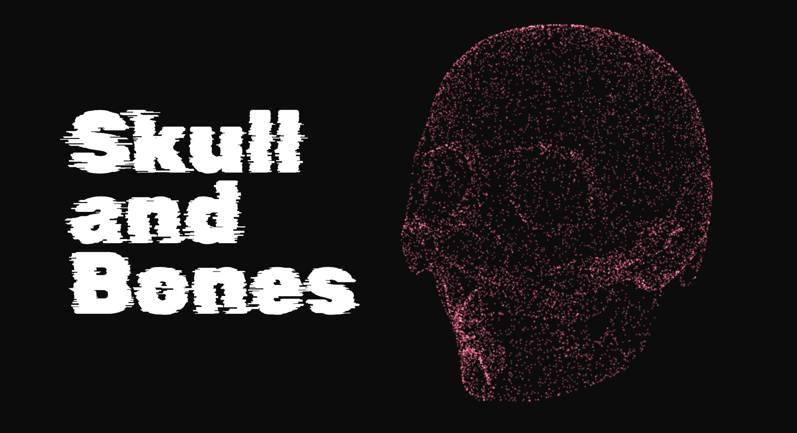
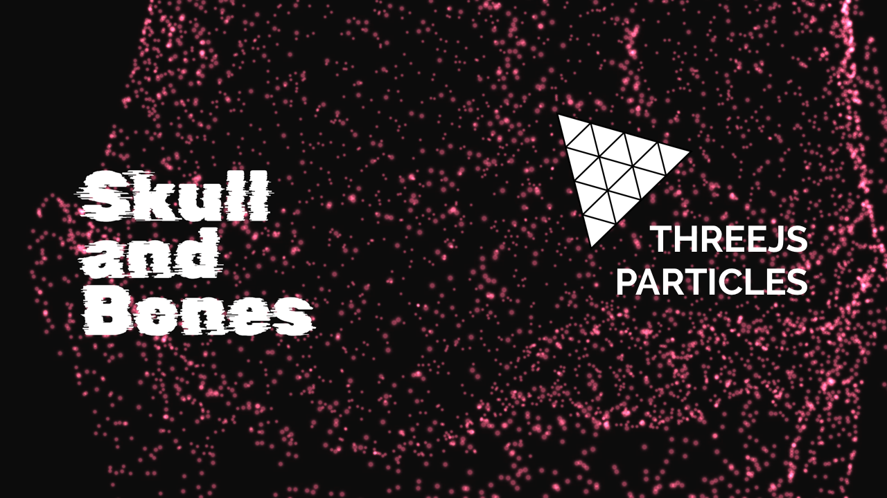

# THREEJS Particle System Skull
<h4>by Anderson Mancini</h4>

<p align="center">
    <a href="https://threejs-particle-skull.vercel.app" target="_blank"></a>
</p>

# Live Link
Click here: <a href="https://threejs-particle-skull.vercel.app" target="_blank">https://threejs-particle-skull.vercel.app</a>

# Introduction
This project converts any GLTF looaded model into a particle system using threejs points material. It is using my previous three.js boilerplate.

You can replace the model and change the camera animations to make your own scene.

Resources: [Threejs](https://threejs.org/), [WebGL](https://github.com/KhronosGroup/WebGL), [webpack](https://webpack.js.org/) , [Babel](https://babeljs.io/ ), [ESLint](https://eslint.org/)

# Show, don't tell 
Here you can see a video on how I created it
<a href="https://www.youtube.com/watch?v=0zPSfCvUoQ4" target="_blank"></a>

# Getting Started
Download and install Node.js on your computer (https://nodejs.org/en/download/).

Then, open VSCODE, drag the project folder to it. Open VSCODE terminal and install dependencies (you need to do this only in the first time)
```
npm install
```

Run this command in your terminal to open a local server at localhost:8080
```
npm run dev
```

# Notes
Would be really appreciated if you are willing to give me a star here on GitHub 🎉 or buy me a coffee ☕ https://www.buymeacoffee.com/andersonmancini. The money will be used to produce more content about threejs or to buy new courses.